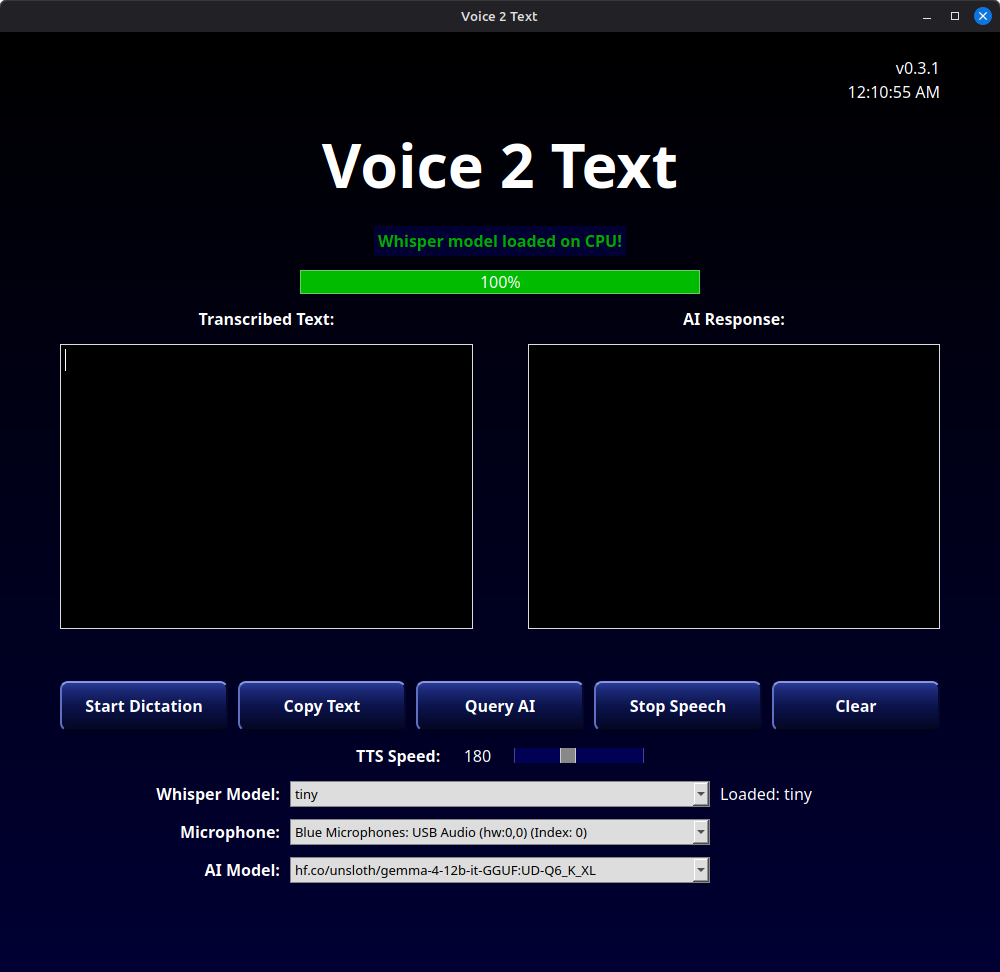
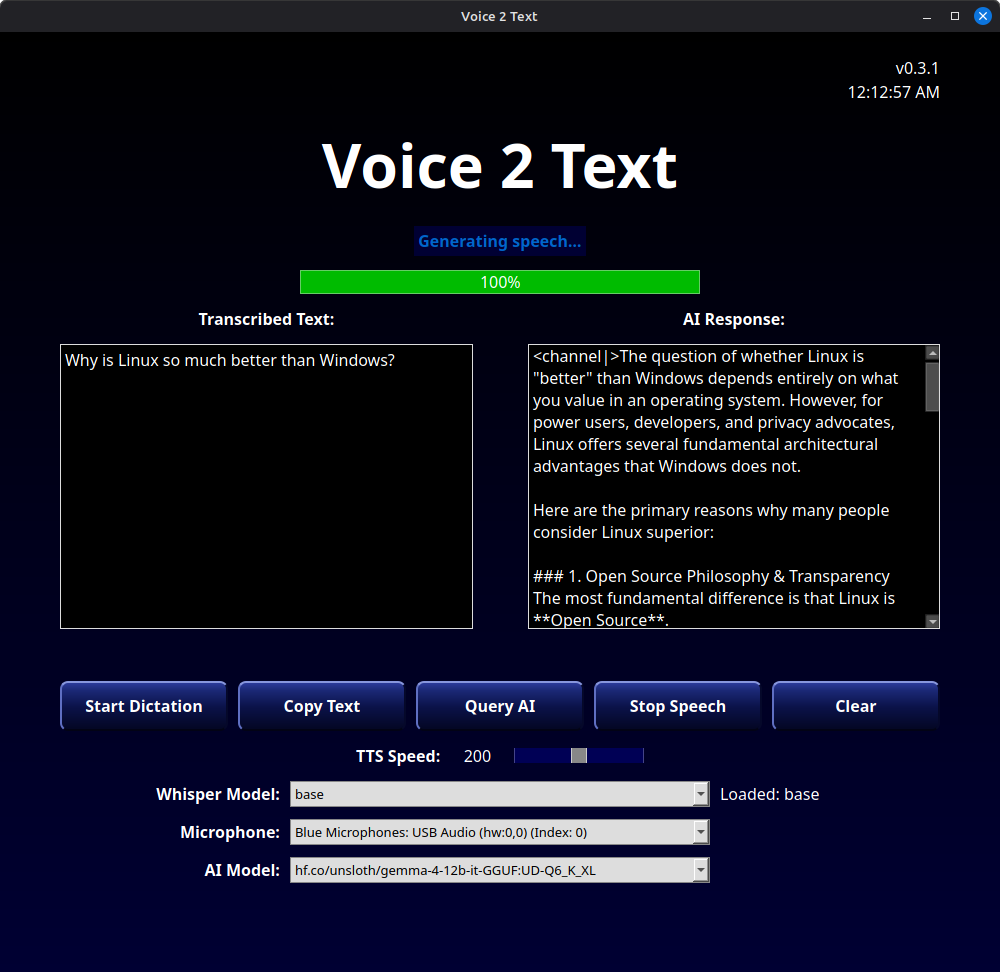
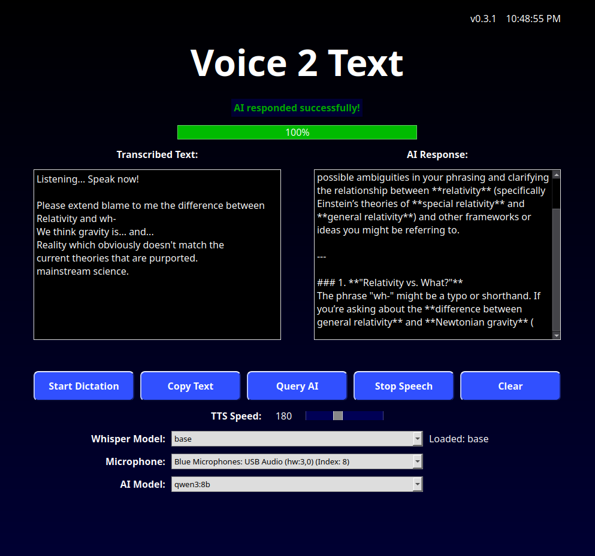

# Voice2Text-AI

A Linux desktop app for voice dictation, local AI queries, and spoken AI responses.

Voice2Text-AI records from your microphone, transcribes speech with Faster Whisper, sends text to a local Ollama model, and can read the AI response aloud using Edge TTS or an offline eSpeak NG fallback.



## Features

* Real-time voice dictation
* Local speech recognition with Faster Whisper
* Ollama integration for local AI responses
* Text-to-speech playback
* Offline eSpeak NG fallback
* Microphone and model selection
* Copy transcription to clipboard
* PySide6/Qt interface
* Linux Flatpak packaging

## Screenshots





## Install

### GitHub Release Flatpak

Download the latest `.flatpak` bundle from the GitHub Releases page.

Install it:

```bash
flatpak install --user ./Voice2Text-AI-v0.3.1-x86_64.flatpak
```

Run it:

```bash
flatpak run io.github.crhy.voice2textai
```

### From source

Clone the repo:

```bash
git clone https://github.com/crhy/Voice2Text-AI.git
cd Voice2Text-AI
```

Create a virtual environment:

```bash
python3.13 -m venv .venv313
source .venv313/bin/activate
```

Install dependencies:

```bash
python -m pip install -r requirements.txt
```

Run the app:

```bash
python qt_app.py
```

## Ollama setup

Voice2Text-AI uses Ollama for local AI responses.

Install Ollama, start it, and pull a model:

```bash
ollama serve
ollama pull qwen3:8b
```

The app will list available Ollama models in the AI Model dropdown.

## Building the Flatpak

Install Flatpak Builder and required runtimes:

```bash
flatpak install --user flathub org.kde.Platform//6.10 org.kde.Sdk//6.10 io.qt.PySide.BaseApp//6.10
```

Build and install locally:

```bash
flatpak-builder \
  --disable-rofiles-fuse \
  --force-clean \
  --user \
  --install-deps-from=flathub \
  --install \
  build-dir \
  io.github.crhy.voice2textai.yml
```

Run the local build:

```bash
flatpak run io.github.crhy.voice2textai
```

Create a single-file bundle:

```bash
flatpak build-export flatpak-repo build-dir

flatpak build-bundle \
  flatpak-repo \
  Voice2Text-AI-v0.3.1-x86_64.flatpak \
  io.github.crhy.voice2textai \
  master \
  --runtime-repo=https://flathub.org/repo/flathub.flatpakrepo
```

## Troubleshooting

### Ollama models do not appear

Make sure Ollama is running:

```bash
ollama serve
```

Then restart Voice2Text-AI.

### No microphone appears

Check that your microphone is visible to Linux:

```bash
pactl list short sources
```

For Flatpak builds, make sure the app has audio permissions.

### No speech output

The Flatpak build uses PulseAudio/PipeWire for audio playback. Make sure your system output device is working, then restart the app.

### First launch is slow

The selected Whisper model may need to download the first time. Smaller models such as `tiny` and `base` load faster.

## Project status

Voice2Text-AI is currently focused on Linux desktop support through Flatpak and source installs.

The current interface is built with PySide6/Qt. Older Tk, Kivy, Android, and experimental files may be kept only as legacy references.

## License

See `LICENSE`.
